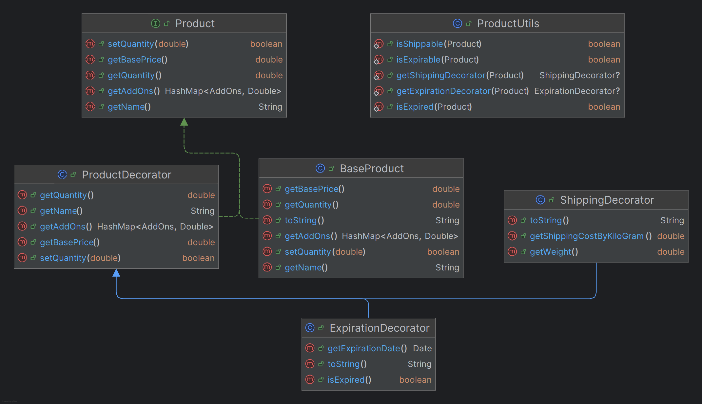

# Shopping Cart Application

## Overview

This project is a Java-based shopping cart application that demonstrates the use of the **Decorator Design Pattern** to
add dynamic functionalities to products. It also incorporates utility classes, enums, and services to handle various
aspects of the application, such as shipping, expiration, and cart processing.

---

## Assumptions

**Products are sold by either weight or quantity.** For example, vegetables and cheese are sold by weight, while books and
electronics are sold by quantity.

**Shipping costs are calculated based on both product weight and type.** Some products, like cheese, may require
air-conditioned shipping and careful handling, which could increase costs. Others, like books, do not have these
requirements.

**Expired products cannot be added to the cart.** If you attempt to add an expired product, it won't be added, and you'll
receive a warning message along with a `false` result.

**Out-of-stock products cannot be added to the cart.** If you attempt to add a product that's not available in stock, it
won't be added, and you'll receive a warning message along with a `false` result.

---

## Design

### 1. **Decorator Design Pattern**

The **Decorator Pattern** is used to dynamically add functionalities to products:

- **`ShippingDecorator`**: Adds shipping cost and weight to a product.
- **`ExpirationDecorator`**: Adds an expiration date to a product.

This pattern allows for flexible and reusable extensions without modifying the base product class.

### 2. **Separation of Concerns**

The project is designed with modularity in mind:

- **Core Logic**: Handled by the `Cart` class, specifically in
  the `processCart` method. This method iterates over each product in
  the cart and delegates the responsibility of invoking the appropriate
  actions based on the add-ons associated with the product to the `AddOnProcessor`.
  The results of these actions are then returned to `processCart`, where they are combined to
  calculate totals such as base price, shipping cost, and weight.
- **Add-On Processing**: Managed by `AddOnProcessor` and its actions.
- **Utilities**: Encapsulated in helper classes like `ProductUtils` and `ColorHelper`.
- **Shipping**: Isolated in the `shipping` package.

### 3. **Enums**

Enums are used to define constants for:

- **`ProductName`**: Names of products.
- **`AddOns`**: Types of add-ons (e.g., shipping price, base price, weight).

---

## Architecture

### 1. **Packages**

The project is organized into the following packages:

- **`decorator/`**: Contains core classes and decorators for products.
- **`addOnsActions/`**: Handles add-on processing logic.
- **`enums/`**: Contains enums for product names and add-ons.
- **`shipping/`**: Manages shipping-related operations.

### 2. **Core Classes**

- **`Product`**: Abstract class representing a product.
- **`BaseProduct`**: Concrete implementation of a product.
- **`ProductDecorator`**: Abstract decorator class for extending product functionality.
- **`ExpirationDecorator`**: Adds expiration functionality to products.
- **`ShippingDecorator`**: Adds shipping functionality to products.

### 3. **Cart Management**

- **`Cart`**: Manages the shopping cart, processes products, and calculates totals.
- **`CartItem`**: Represents a product and its quantity in the cart.

### 4. **Add-On Processing**

- **`AddOnProcessor`**: Processes add-ons (e.g., shipping price, base price) for products.
- **`AddOnAction`**: Interface for add-on actions.
- **`ShippingAction`** and **`BaseAction`**: Implementations of add-on actions.

### 5. **Utilities**

- **`ProductUtils`**: Provides utility methods for product-related operations (e.g., checking expiration).

### 6. **Shipping**

- **`ShippingService`**: Handles the shipping process for shippable items.
- **`Shippable`**: Interface for products that can be shipped.

---

## Features

- Add products to the cart with dynamic functionalities (e.g., shipping, expiration).
- Process the cart and calculate totals (base price, shipping cost, weight).
- Handle edge cases like expired products, insufficient balance, and insufficient stock.

---

## Extensibility

The architecture of this project is designed to be highly extensible, allowing new features to be added with minimal
changes to the existing codebase. For example, to add a **discount** feature to products, the following steps can be
taken:

### Steps to Add Discount Functionality

1. **Create a New Decorator**:
    - Add a new decorator class, e.g., `DiscountDecorator`, that extends `ProductDecorator`.
    - This class will handle the discount logic (e.g., applying a percentage or fixed discount to the base price).

2. **Update the `AddOns` Enum**:
    - Add a new constant, e.g., `Discount`, to the `AddOns` enum to represent the discount feature.

3. **Update the `AddOnProcessor`**:
    - Add a new `DiscountAction` class implementing `AddOnAction` to calculate the discount.
    - Register the `DiscountAction` in the `AddOnProcessor` constructor.

4. **Modify the `Cart` Class**:
    - Ensure the `Cart` processes the discount add-on when calculating the total price.

This same steps can be followed to add other features like free shipping, etc.

---

## Decorator Class Diagram

---

## LLMs Usage

LLMs were used to generate the docs, including the README, class descriptions, and method summaries. GitHub Copilot also
assisted in writing the code, especially for repetitive tasks.

---

## How to Run

1. Clone the repository.
2. Open the project in IntelliJ IDEA or any Java IDE.
3. Run the `Main` class located in `src/Main.java`.

---